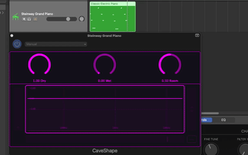

# CaveShape

CaveShape is an experimental reverb effect that places a **graphic EQ inside the feedback network** of the reverb.

  

Unlike a conventional EQ applied to the final reverb output, the EQ shapes the signal that is fed back into the reverb structure. This allows the frequency response of the reverberation to evolve as the signal continues to circulate through the feedback network.

The EQ can also introduce **positive gain within selected frequency regions**. Under these conditions, the feedback can become regenerative, causing particular frequencies to build up progressively rather than simply decay. When the signal exceeds the defined operating range, controlled clipping limits the resulting amplitude.

The combination of **spectral feedback, positive gain, and nonlinear amplitude limiting** can produce sustained and strongly colored reverberation characteristics that differ from those of a conventional room reverb.

### Shaping the cave

CaveShape provides a compact set of controls for the overall reverb behavior, while the integrated graphic EQ provides direct control over the spectral characteristics of the feedback network.

The EQ can therefore be used not only to adjust the tone of the reverb, but to determine which frequency regions are reinforced or attenuated as the reverberant signal develops.

CaveShape is an experimental project exploring the interaction between **reverberation, feedback, spectral shaping, and controlled nonlinearity**.

More information and demonstrations:

* YouTube: https://youtu.be/wFVzWmk2qSU
* MusicaLogic: https://musicalogic.wordpress.com/2026/09/24/caveshape-spectral-feedback-for-reverb/

Part of the **MusicaLogic** experimental VST collection.

<!-- 

ffmpeg -i caveshape_demo_video.mp4 \
  -vf "fps=7,scale=420:-1:flags=lanczos,split[s0][s1];[s0]palettegen[p];[s1][p]paletteuse" \
  -loop 0 caveshape-demo.gif

 -->